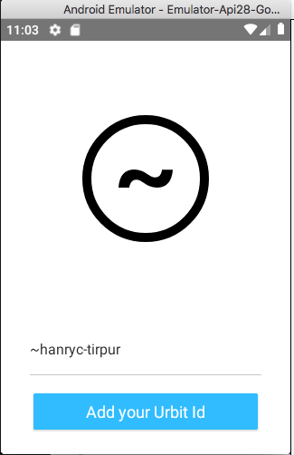
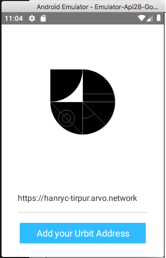
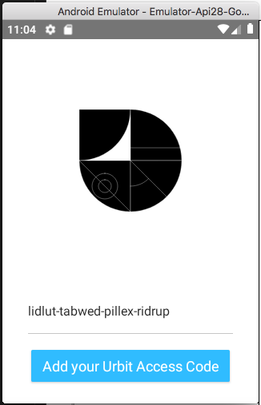

# Urbit Hackathon Entry

## Description

This entry is a cross-platform mobile app using NativeScript. It defines a login flow that allows a user to setup an urbit connection and then access an existing agent on that urbit.

As shown below, when first run, the app allows the user to progress through each step and validates that the entered information is correct along the way.

  

After the user has successfully connected to an Urbit, the app will then query the Urbit to get the user's entered weights for display.


#### Notes
- Due to an issue with the Android Server Sent Events library, I was unable to use `channel.js` to connect an `EventSource` to the Urbit. (The library uses a `GET` request to initiate the `EventSource` and Urbit requires a `PUT`)
- I also could not figure out how to set the state during an http request


## Setup

After cloning the repository, you will need to do the following

- Run `npm install`
- Create an `.urbitrc` file in the root directory of the project with the path to your pier
```
module.exports = {
  URBIT_PIERS: [
    "<full path to your pier>",
  ]
};
```
- (optional) - Setup the android emulator by following the instructions [here](https://docs.nativescript.org/tooling/android-virtual-devices)

## Urbit Agent
After completing the setup, you're ready to install the Urbit `weight-app` agent. You can do so using the following steps
- Run `npm run sync` from the root of the repository
- In the Urbit dojo run
    - `> |commit %home`
    - `> |start %weight-app`

Once installed, you can add some weights to the agent using the following command in the Urbit dojo
`> :weight-app &weight-app-action [%add-weight 180]`

## Mobile App
There are a few ways to install the mobile app on android
- Run locally with emulator: `npx tns run android`
- You can also install the `.apk` located in the [releases]()
